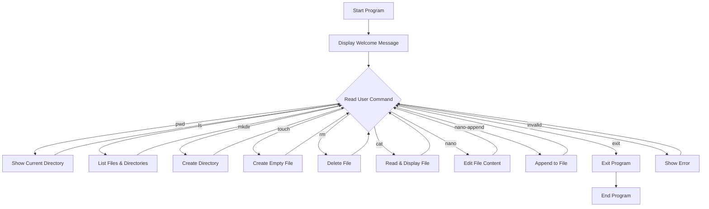
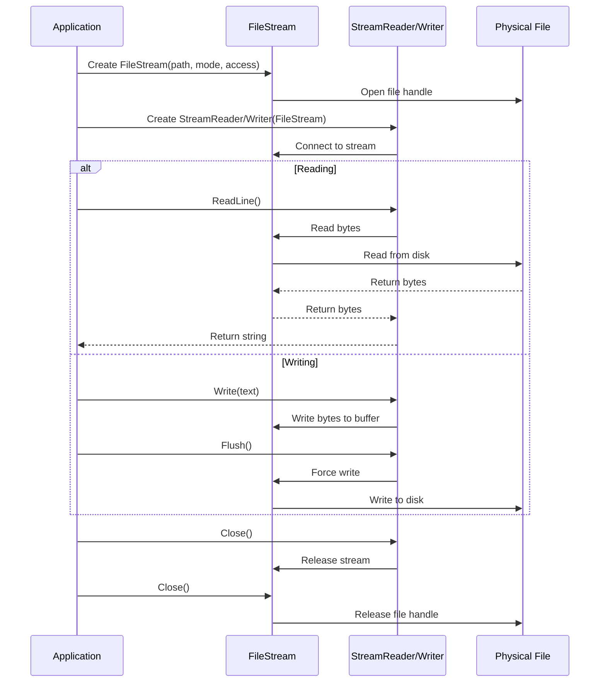

# Lab: File Streams in C#

## Overview

This lab demonstrates how to work with **file streams** in C# by building a simple Linux-style command-line emulator on Windows. You will learn how to perform file and directory operations using the `System.IO` namespace, including reading from and writing to files using streams.

---

## Learning Objectives

By the end of this lab, you should be able to:

1. Understand the concept of **streams** in C#
2. Use `FileStream`, `StreamReader`, and `StreamWriter` classes
3. Perform file operations (create, read, write, append, delete)
4. Perform directory operations (list, create)
5. Understand different `FileMode` and `FileAccess` options

---

## What is a Stream?

A **stream** is an abstraction that represents a sequence of bytes. In C#, streams are used to read from and write to various data sources, such as:

- Files on disk
- Network connections
- Memory buffers

The `System.IO.Stream` class is the base class for all streams in .NET. Common derived classes include:

- **FileStream**: For reading/writing files
- **MemoryStream**: For in-memory data
- **NetworkStream**: For network data

---

## Program Architecture



---

## Code Explanation

### 1. Main Program Loop

The main method displays a prompt and continuously reads user commands until the user types `exit`.

```csharp
while (!exit)
{
    Console.Write("mmabas@SDOps:~$ ");
    string input = Console.ReadLine() ?? "";
    // Command processing via switch statement
}
```

### 2. Directory Operations

#### **pwd** - Print Working Directory

Shows the current directory path and metadata:

```csharp
public static void Pwd()
{
    var currentDir = Directory.GetCurrentDirectory();
    DirectoryInfo dirinfo = new DirectoryInfo(currentDir);
    Console.WriteLine(dirinfo.FullName);
    Console.WriteLine("Full Name of the directory is : {0}", dirinfo.FullName);
    Console.WriteLine("The directory was last accesses on: {0}", dirinfo.LastAccessTime.ToString());
}
```

#### **ls** - List Directory Contents

Lists all files and subdirectories in the current directory:

```csharp
public static void Ls()
{
    var currentDir = Directory.GetCurrentDirectory();
    DirectoryInfo dirinfo = new DirectoryInfo(currentDir);
    
    FileInfo[] filesInDir = dirinfo.GetFiles();
    DirectoryInfo[] dirsInDir = dirinfo.GetDirectories();
    
    foreach (var directoryInfo in dirsInDir)
    {
        Console.WriteLine("{0}      -----      {1}", directoryInfo.Name, directoryInfo.LastAccessTime);
    }
    foreach (FileInfo file in filesInDir)
    {
        Console.WriteLine("{0}      {1}      {2}", file.Name, file.Length, file.LastAccessTime);
    }
}
```

#### **mkdir** - Create Directory

Creates a new directory if it doesn't already exist:

```csharp
public static void MkDir()
{
    Console.Write("Enter the name of the directory: ");
    var name = Console.ReadLine();
    
    if (string.IsNullOrEmpty(name))
    {
        Console.WriteLine("Directory name cannot be empty.");
        return;
    }
    
    if (Directory.Exists(name))
    {
        Console.WriteLine("Directory already exists.");
        return;
    }
    
    Directory.CreateDirectory(name);
}
```

---

### 3. File Operations

#### **touch** - Create Empty File

Creates a new empty file:

```csharp
public static void Touch()
{
    Console.Write("Enter the name of the file: ");
    var name = Console.ReadLine();
    
    if (string.IsNullOrEmpty(name))
    {
        Console.WriteLine("File name cannot be empty.");
        return;
    }
    
    if (File.Exists(name))
    {
        Console.WriteLine("File already exists.");
        return;
    }
    
    var fs = File.Create(name);
    fs.Close();  // Important: Always close the stream after use
}
```

**Note**: It's important to close the `FileStream` after creation to release the file handle.

#### **rm** - Remove File

Deletes a file after validation:

```csharp
private static void Rm()
{
    Console.Write("Enter the name of the file: ");
    var name = Console.ReadLine();
    if (!ValidateExists(name)) return;
    
    File.Delete(name);
}
```

---

### 4. Stream Operations

#### **cat** - Read and Display File

Reads the entire file content and displays it:

```csharp
private static void Cat()
{
    Console.Write("Enter the name of the file: ");
    var name = Console.ReadLine();
    if (!ValidateExists(name)) return;
    
    var content = File.ReadAllText(name);
    Console.WriteLine(content);
}
```

**Note**: `File.ReadAllText()` is a convenience method that internally uses streams.

#### **nano-append** - Append Text to File

Appends new text to the end of an existing file:

```csharp
private static void NanoAppend()
{
    Console.Write("Enter the name of the file: ");
    var name = Console.ReadLine();
    if (!ValidateExists(name)) return;
    
    Console.Write("Enter the text to append: ");
    var text = Console.ReadLine();
    
    if (string.IsNullOrEmpty(text))
    {
        Console.WriteLine("Text cannot be empty.");
        return;
    }
    
    File.AppendAllText(name, text);
}
```

#### **nano** - Edit File Content

This is the most important function for understanding streams. It reads the old content, then writes new content:

```csharp
private static void Nano()
{
    Console.Write("Enter the name of the file: ");
    var name = Console.ReadLine();
    if (!ValidateExists(name)) return;
    
    Console.WriteLine("----- ------ ----- [Old Content] ----- ------ -----");
    ReadFileData(name);
    
    Console.WriteLine("----- ------ ----- [Please write the new content] ----- ------ -----");
    WriteFileData(name);
}
```

---

### 5. Working with Streams Directly

#### Reading with Streams

```csharp
private static void ReadFileData(string? name)
{
    FileStream fs = new FileStream(name, FileMode.OpenOrCreate, FileAccess.ReadWrite);
    StreamReader sr = new StreamReader(fs);
    sr.BaseStream.Seek(0, SeekOrigin.Begin);  // Move to start of file
    
    string str = sr.ReadLine();
    while (str != null)
    {
        Console.WriteLine("{0}", str);
        str = sr.ReadLine();
    }
    
    sr.Close();
    fs.Close();
}
```

**Key Concepts**:
- `FileMode.OpenOrCreate`: Opens file if it exists, creates it if it doesn't
- `FileAccess.ReadWrite`: Allows both reading and writing
- `Seek()`: Moves the stream position to a specific location
- `SeekOrigin.Begin`: Specifies the beginning of the stream

#### Writing with Streams

```csharp
private static void WriteFileData(string? name)
{
    FileStream fs = new FileStream(name, FileMode.Create, FileAccess.ReadWrite);
    StreamWriter w = new StreamWriter(fs);
    
    var text = Console.ReadLine();
    if (string.IsNullOrEmpty(text))
    {
        Console.WriteLine("Text cannot be empty.");
        return;
    }
    
    w.Write(text);
    w.Flush();  // Ensures data is written to disk
    w.Close();
    fs.Close();
}
```

**Key Concepts**:
- `FileMode.Create`: Creates a new file or overwrites existing one
- `Flush()`: Forces buffered data to be written to the file
- Always close streams in the correct order: StreamWriter first, then FileStream

---

## FileMode Options

| Mode | Description |
|------|-------------|
| `CreateNew` | Creates a new file; throws exception if file exists |
| `Create` | Creates a new file; overwrites if file exists |
| `Open` | Opens an existing file; throws exception if file doesn't exist |
| `OpenOrCreate` | Opens file if it exists, creates new one if it doesn't |
| `Truncate` | Opens and clears existing file content |
| `Append` | Opens file and moves to end for appending |

---

## FileAccess Options

| Access | Description |
|--------|-------------|
| `Read` | Read-only access |
| `Write` | Write-only access |
| `ReadWrite` | Both read and write access |

---

## Stream Workflow



---

## Validation Helper

The program uses a validation method to check if files exist:

```csharp
private static bool ValidateExists(string? name)
{
    if (string.IsNullOrEmpty(name))
    {
        Console.WriteLine("File name cannot be empty.");
        return false;
    }
    
    if (!File.Exists(name))
    {
        Console.WriteLine("File does not exist.");
        return false;
    }
    
    return true;
}
```

---

## Usage Examples

### Example Session

```
Welcome to Linux emulation on Windows!

mmabas@SDOps:~$ pwd
C:\Users\Student\Projects
Full Name of the directory is : C:\Users\Student\Projects
The directory was last accesses on: 10/26/2025 2:30:00 PM

mmabas@SDOps:~$ touch myfile.txt

mmabas@SDOps:~$ nano
Enter the name of the file: myfile.txt
----- ------ ----- [Old Content] ----- ------ -----
----- ------ ----- [Please write the new content] ----- ------ -----
Hello, this is my first file!

mmabas@SDOps:~$ cat
Enter the name of the file: myfile.txt
Hello, this is my first file!

mmabas@SDOps:~$ nano-append
Enter the name of the file: myfile.txt
Enter the text to append: This is appended text.

mmabas@SDOps:~$ cat
Enter the name of the file: myfile.txt
Hello, this is my first file!This is appended text.

mmabas@SDOps:~$ exit
```

---

## Best Practices

1. **Always close streams**: Unclosed streams can lock files and cause resource leaks
2. **Use `using` statements** (alternative approach):
   ```csharp
   using (FileStream fs = new FileStream(path, FileMode.Open))
   {
       // Stream automatically closed when leaving this block
   }
   ```
3. **Call `Flush()`** when writing critical data to ensure it's written to disk
4. **Validate inputs** before performing file operations
5. **Handle exceptions** in production code (try-catch blocks)

---

## Exercises

1. **Modify the `nano` command** to use a `using` statement instead of explicit `Close()` calls
2. **Add a `cp` command** that copies a file from one location to another using streams
3. **Implement a `wc` command** that counts lines, words, and characters in a file
4. **Add exception handling** to all file operations
5. **Create a `head` command** that displays the first N lines of a file
6. **Implement a `tail` command** that displays the last N lines of a file

---

## Key Takeaways

- **Streams** provide a unified way to work with sequential data
- **FileStream** is the low-level class for file I/O
- **StreamReader/StreamWriter** provide convenient text-based operations on top of streams
- Always **close or dispose** streams to release system resources
- Different **FileMode** options control how files are opened or created
- **Buffering** improves performance, but requires `Flush()` for immediate writes
