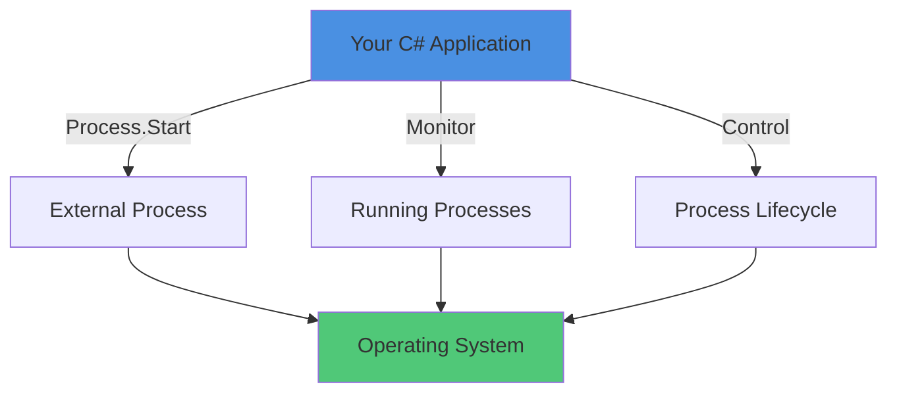
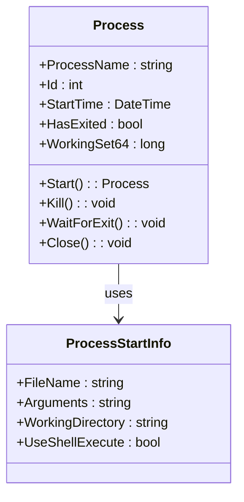
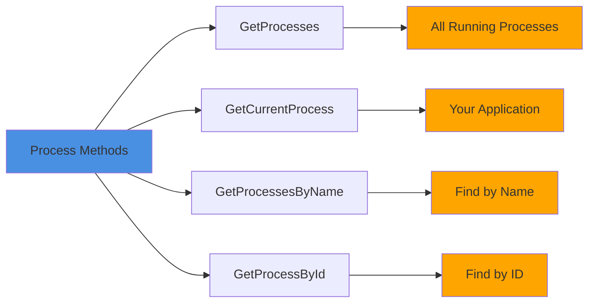
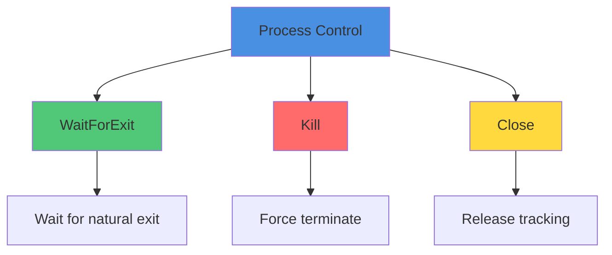
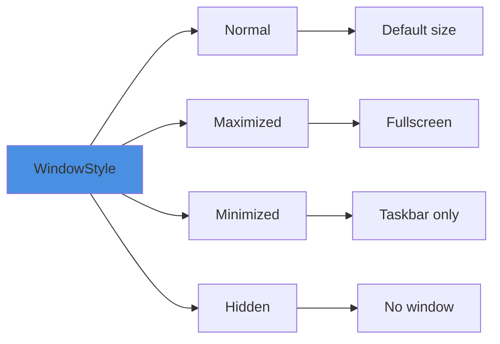
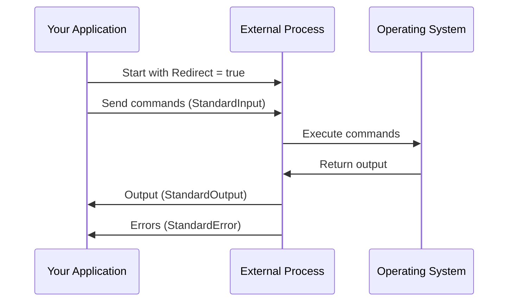
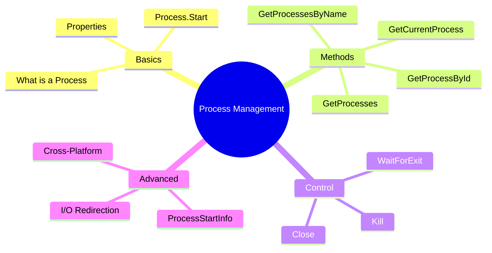

# Operating Systems Lab - Week 5: Process Management in C#

## Table of Contents
1. [Introduction](#introduction)
2. [Getting Started with Processes](#getting-started-with-processes)
3. [Process Class Basics](#process-class-basics)
4. [Process Methods Explained](#process-methods-explained)
5. [ProcessStartInfo - Advanced Configuration](#processstartinfo---advanced-configuration)
6. [Cross-Platform Development](#cross-platform-development)
7. [Complete Working Examples](#complete-working-examples)
8. [Lab Exercises](#lab-exercises)
9. [Quick Reference Guide](#quick-reference-guide)

---

## Introduction

### What is a Process?

A **process** is a running instance of a program. When you double-click an application, the operating system creates a process for it.

**Each process has:**
- Its own memory space (isolated from other processes)
- Unique Process ID (PID)
- Resources (files, network connections, etc.)
- Execution state (running, waiting, etc.)

**Example:** When you open Notepad, the OS creates a "notepad.exe" process.



### Why Learn Process Management?

Process management allows your C# applications to:
- ✅ **Launch other applications** (open text editors, browsers, calculators)
- ✅ **Monitor system processes** (track memory usage, CPU usage)
- ✅ **Control process lifecycle** (start, stop, wait for processes)
- ✅ **Execute shell commands** (run system commands programmatically)
- ✅ **Automate tasks** (system administration, testing, deployment)

**Real-World Uses:**
- System monitoring tools
- Automated testing frameworks
- Deployment scripts
- Task automation
- System administration utilities

---

## Getting Started with Processes

### Your First Process Program

Let's start with the simplest possible example:

#### Windows - Opening Notepad:
```csharp
using System.Diagnostics;

class Program
{
    static void Main()
    {
        Process.Start("notepad.exe");
    }
}
```

#### Linux - Opening Text Editor:
```csharp
using System.Diagnostics;

class Program
{
    static void Main()
    {
        Process.Start("xed");
    }
}
```

That's it! This single line tells the operating system to start a new process.

---

### Opening a File with an Application

#### Windows:
```csharp
using System.Diagnostics;

class Program
{
    static void Main()
    {
        Process.Start("notepad.exe", "example.txt");
    }
}
```

#### Linux:
```csharp
using System.Diagnostics;

class Program
{
    static void Main()
    {
        Process.Start("xed", "example.txt");
    }
}
```

---

### Getting Information About Your Process

#### Windows:
```csharp
using System;
using System.Diagnostics;

class Program
{
    static void Main()
    {
        Process process = Process.Start("notepad.exe");
        
        Console.WriteLine($"Process Name: {process.ProcessName}");
        Console.WriteLine($"Process ID: {process.Id}");
        
        Console.WriteLine("\nPress Enter to close the program...");
        Console.ReadLine();
    }
}
```

#### Linux:
```csharp
using System;
using System.Diagnostics;

class Program
{
    static void Main()
    {
        Process process = Process.Start("xed");
        
        Console.WriteLine($"Process Name: {process.ProcessName}");
        Console.WriteLine($"Process ID: {process.Id}");
        
        Console.WriteLine("\nPress Enter to close the program...");
        Console.ReadLine();
    }
}
```

**Output Example (Windows):**
```
Process Name: notepad
Process ID: 12345

Press Enter to close the program...
```

**Output Example (Linux):**
```
Process Name: xed
Process ID: 12345

Press Enter to close the program...
```

---

## Process Class Basics

### The System.Diagnostics Namespace

All process management functionality is in the `System.Diagnostics` namespace:

```csharp
using System.Diagnostics;  // Always include this
```

### Process Class Overview



### Important Properties

| Property | Type | Description | Example |
|----------|------|-------------|---------|
| `ProcessName` | string | Name of the process | "notepad" |
| `Id` | int | Unique Process ID (PID) | 12345 |
| `StartTime` | DateTime | When process started | 2025-11-03 10:30:00 |
| `HasExited` | bool | Is process still running? | false |
| `WorkingSet64` | long | Memory usage (bytes) | 15728640 |

### Example: Accessing Process Properties

#### Windows:
```csharp
using System;
using System.Diagnostics;

class Program
{
    static void Main()
    {
        Process process = Process.Start("notepad.exe");
        
        Console.WriteLine("=== Process Information ===");
        Console.WriteLine($"Process Name: {process.ProcessName}");
        Console.WriteLine($"Process ID: {process.Id}");
        Console.WriteLine($"Start Time: {process.StartTime}");
        Console.WriteLine($"Memory (KB): {process.WorkingSet64 / 1024}");
        Console.WriteLine($"Has Exited: {process.HasExited}");
        
        Console.WriteLine("\nClose Notepad to continue...");
        process.WaitForExit();
        
        Console.WriteLine("\nNotepad has been closed!");
        Console.WriteLine($"Has Exited: {process.HasExited}");
    }
}
```

#### Linux:
```csharp
using System;
using System.Diagnostics;

class Program
{
    static void Main()
    {
        Process process = Process.Start("xed");
        
        Console.WriteLine("=== Process Information ===");
        Console.WriteLine($"Process Name: {process.ProcessName}");
        Console.WriteLine($"Process ID: {process.Id}");
        Console.WriteLine($"Start Time: {process.StartTime}");
        Console.WriteLine($"Memory (KB): {process.WorkingSet64 / 1024}");
        Console.WriteLine($"Has Exited: {process.HasExited}");
        
        Console.WriteLine("\nClose xed to continue...");
        process.WaitForExit();
        
        Console.WriteLine("\nxed has been closed!");
        Console.WriteLine($"Has Exited: {process.HasExited}");
    }
}
```

---

## Process Methods Explained

### Information Retrieval Methods



### 1. GetProcesses() - List All Processes

Gets **every process** running on the system.

```csharp
using System;
using System.Diagnostics;

class Program
{
    static void Main()
    {
        Process[] processes = Process.GetProcesses();
        
        Console.WriteLine($"Total processes: {processes.Length}\n");
        
        // Show first 10 processes
        for (int i = 0; i < 10 && i < processes.Length; i++)
        {
            Console.WriteLine($"{processes[i].ProcessName} (PID: {processes[i].Id})");
        }
    }
}
```

**Output Example:**
```
Total processes: 287

System (PID: 4)
svchost (PID: 756)
explorer (PID: 2184)
chrome (PID: 5432)
notepad (PID: 8912)
...
```

### 2. GetCurrentProcess() - Your Application

Gets the process for **your own application**.

```csharp
using System;
using System.Diagnostics;

class Program
{
    static void Main()
    {
        Process me = Process.GetCurrentProcess();
        
        Console.WriteLine("=== My Process Info ===");
        Console.WriteLine($"Name: {me.ProcessName}");
        Console.WriteLine($"PID: {me.Id}");
        Console.WriteLine($"Memory: {me.WorkingSet64 / 1024} KB");
        Console.WriteLine($"Threads: {me.Threads.Count}");
    }
}
```

### 3. GetProcessesByName() - Find by Name

Find **all processes** with a specific name.

```csharp
using System;
using System.Diagnostics;

class Program
{
    static void Main()
    {
        string name = "chrome";  // Process name to search
        Process[] processes = Process.GetProcessesByName(name);
        
        Console.WriteLine($"Found {processes.Length} instance(s) of {name}\n");
        
        foreach (Process p in processes)
        {
            double memoryMB = p.WorkingSet64 / (1024.0 * 1024.0);
            Console.WriteLine($"PID {p.Id}: {memoryMB:F2} MB");
        }
    }
}
```

**Output Example:**
```
Found 3 instance(s) of chrome

PID 5432: 125.34 MB
PID 6128: 89.21 MB
PID 7456: 112.67 MB
```

### 4. GetProcessById() - Find by Process ID

Find a **specific process** by its PID.

```csharp
using System;
using System.Diagnostics;

class Program
{
    static void Main()
    {
        try
        {
            int pid = 1234;  // Replace with actual PID
            Process process = Process.GetProcessById(pid);
            
            Console.WriteLine($"Found process:");
            Console.WriteLine($"Name: {process.ProcessName}");
            Console.WriteLine($"ID: {process.Id}");
        }
        catch (ArgumentException)
        {
            Console.WriteLine("Process not found!");
        }
    }
}
```

### Process Control Methods



### 5. WaitForExit() - Wait for Process

#### Wait forever - Windows:
```csharp
Process process = Process.Start("notepad.exe");
Console.WriteLine("Waiting for Notepad...");
process.WaitForExit();  // Blocks until Notepad closes
Console.WriteLine("Notepad closed!");
```

#### Wait forever - Linux:
```csharp
Process process = Process.Start("xed");
Console.WriteLine("Waiting for xed...");
process.WaitForExit();  // Blocks until xed closes
Console.WriteLine("xed closed!");
```

#### Wait with timeout - Windows:
```csharp
Process process = Process.Start("notepad.exe");
bool exited = process.WaitForExit(5000);  // Wait max 5 seconds

if (exited)
{
    Console.WriteLine("Process exited within 5 seconds");
}
else
{
    Console.WriteLine("Process still running after 5 seconds");
}
```

#### Wait with timeout - Linux:
```csharp
Process process = Process.Start("xed");
bool exited = process.WaitForExit(5000);  // Wait max 5 seconds

if (exited)
{
    Console.WriteLine("Process exited within 5 seconds");
}
else
{
    Console.WriteLine("Process still running after 5 seconds");
}
```

### 6. Kill() - Force Terminate

⚠️ **Warning:** `Kill()` terminates immediately without cleanup!

#### Windows:
```csharp
using System;
using System.Diagnostics;
using System.Threading;

class Program
{
    static void Main()
    {
        Process process = Process.Start("notepad.exe");
        
        Console.WriteLine("Notepad will be killed in 5 seconds...");
        Thread.Sleep(5000);
        
        process.Kill();
        process.WaitForExit();
        
        Console.WriteLine("Notepad terminated!");
    }
}
```

#### Linux:
```csharp
using System;
using System.Diagnostics;
using System.Threading;

class Program
{
    static void Main()
    {
        Process process = Process.Start("xed");
        
        Console.WriteLine("xed will be killed in 5 seconds...");
        Thread.Sleep(5000);
        
        process.Kill();
        process.WaitForExit();
        
        Console.WriteLine("xed terminated!");
    }
}
```

### 7. Close() - Release Resources

`Close()` releases **your tracking** of the process, but the process **keeps running**.

#### Windows:
```csharp
Process process = Process.Start("notepad.exe");
Console.WriteLine("Notepad started");

process.Close();  // Your app stops tracking it
Console.WriteLine("Tracking released (Notepad still running)");
```

#### Linux:
```csharp
Process process = Process.Start("xed");
Console.WriteLine("xed started");

process.Close();  // Your app stops tracking it
Console.WriteLine("Tracking released (xed still running)");
```

**Difference:**
- `Kill()`: Terminates the process ❌
- `Close()`: Stops tracking the process, but it keeps running ✅

---

## ProcessStartInfo - Advanced Configuration

### What is ProcessStartInfo?

`ProcessStartInfo` gives you **fine control** over how a process starts.

**Basic usage:**
```csharp
ProcessStartInfo startInfo = new ProcessStartInfo
{
    FileName = "notepad.exe",
    Arguments = "example.txt"
};

Process.Start(startInfo);
```

### Key Properties

| Property | Type | Description |
|----------|------|-------------|
| `FileName` | string | Program to run |
| `Arguments` | string | Command-line arguments |
| `WorkingDirectory` | string | Directory to run from |
| `UseShellExecute` | bool | Use OS shell (true) or direct (false) |
| `WindowStyle` | enum | Normal, Maximized, Minimized, Hidden |
| `CreateNoWindow` | bool | Don't create console window |
| `RedirectStandardOutput` | bool | Capture output |
| `RedirectStandardInput` | bool | Send input |
| `RedirectStandardError` | bool | Capture errors |

### Example: Basic Configuration

#### Windows:
```csharp
using System;
using System.Diagnostics;

class Program
{
    static void Main()
    {
        ProcessStartInfo startInfo = new ProcessStartInfo
        {
            FileName = "notepad.exe",
            Arguments = "example.txt",
            WindowStyle = ProcessWindowStyle.Maximized
        };
        
        Process.Start(startInfo);
        Console.WriteLine("Notepad opened (maximized)");
    }
}
```

#### Linux:
```csharp
using System;
using System.Diagnostics;

class Program
{
    static void Main()
    {
        ProcessStartInfo startInfo = new ProcessStartInfo
        {
            FileName = "xed",
            Arguments = "example.txt",
            WindowStyle = ProcessWindowStyle.Maximized
        };
        
        Process.Start(startInfo);
        Console.WriteLine("xed opened (maximized)");
    }
}
```

### Window Styles



**Example:**

#### Windows:
```csharp
// Normal window
new ProcessStartInfo { FileName = "notepad.exe", WindowStyle = ProcessWindowStyle.Normal };

// Maximized window
new ProcessStartInfo { FileName = "notepad.exe", WindowStyle = ProcessWindowStyle.Maximized };

// Minimized window
new ProcessStartInfo { FileName = "notepad.exe", WindowStyle = ProcessWindowStyle.Minimized };

// Hidden window
new ProcessStartInfo { FileName = "notepad.exe", WindowStyle = ProcessWindowStyle.Hidden };
```

#### Linux:
```csharp
// Normal window
new ProcessStartInfo { FileName = "xed", WindowStyle = ProcessWindowStyle.Normal };

// Maximized window
new ProcessStartInfo { FileName = "xed", WindowStyle = ProcessWindowStyle.Maximized };

// Minimized window
new ProcessStartInfo { FileName = "xed", WindowStyle = ProcessWindowStyle.Minimized };

// Hidden window
new ProcessStartInfo { FileName = "xed", WindowStyle = ProcessWindowStyle.Hidden };
```

### UseShellExecute Explained

This property is **very important** for understanding how processes start.

**UseShellExecute = true (default):**
- ✅ Can open URLs (https://google.com)
- ✅ Can open documents with default programs
- ❌ Cannot redirect input/output

**UseShellExecute = false:**
- ✅ Can redirect input/output
- ✅ Direct program execution
- ❌ Cannot open URLs directly

**Example - Opening URL (requires true):**
```csharp
ProcessStartInfo startInfo = new ProcessStartInfo
{
    FileName = "https://www.google.com",
    UseShellExecute = true  // Required for URLs
};
Process.Start(startInfo);
```

### Capturing Command Output

To capture output, you must:
1. Set `UseShellExecute = false`
2. Set `RedirectStandardOutput = true`

**Windows Example:**
```csharp
using System;
using System.Diagnostics;

class Program
{
    static void Main()
    {
        ProcessStartInfo startInfo = new ProcessStartInfo
        {
            FileName = "cmd.exe",
            Arguments = "/c date /t",  // Get current date
            UseShellExecute = false,
            RedirectStandardOutput = true,
            CreateNoWindow = true
        };
        
        Process process = Process.Start(startInfo);
        string output = process.StandardOutput.ReadToEnd();
        process.WaitForExit();
        
        Console.WriteLine("Command output:");
        Console.WriteLine(output);
    }
}
```

**Linux Example:**
```csharp
using System;
using System.Diagnostics;

class Program
{
    static void Main()
    {
        ProcessStartInfo startInfo = new ProcessStartInfo
        {
            FileName = "/bin/bash",
            Arguments = "-c \"date\"",  // Get current date
            UseShellExecute = false,
            RedirectStandardOutput = true,
            CreateNoWindow = true
        };
        
        Process process = Process.Start(startInfo);
        string output = process.StandardOutput.ReadToEnd();
        process.WaitForExit();
        
        Console.WriteLine("Command output:");
        Console.WriteLine(output);
    }
}
```

### Redirecting Input, Output, and Errors



**Complete Example:**
```csharp
using System;
using System.Diagnostics;

class Program
{
    static void Main()
    {
        ProcessStartInfo startInfo = new ProcessStartInfo
        {
            FileName = "cmd.exe",  // Windows
            UseShellExecute = false,
            RedirectStandardInput = true,
            RedirectStandardOutput = true,
            RedirectStandardError = true,
            CreateNoWindow = true
        };
        
        Process process = Process.Start(startInfo);
        
        // Send commands
        process.StandardInput.WriteLine("echo Hello World!");
        process.StandardInput.WriteLine("date /t");
        process.StandardInput.WriteLine("exit");
        
        // Read output
        string output = process.StandardOutput.ReadToEnd();
        string errors = process.StandardError.ReadToEnd();
        
        process.WaitForExit();
        
        Console.WriteLine("=== Output ===");
        Console.WriteLine(output);
        
        if (!string.IsNullOrEmpty(errors))
        {
            Console.WriteLine("\n=== Errors ===");
            Console.WriteLine(errors);
        }
    }
}
```

---

## Cross-Platform Development

### Detecting the Operating System

```csharp
using System;
using System.Runtime.InteropServices;

class Program
{
    static void Main()
    {
        if (RuntimeInformation.IsOSPlatform(OSPlatform.Windows))
        {
            Console.WriteLine("Running on Windows");
        }
        else if (RuntimeInformation.IsOSPlatform(OSPlatform.Linux))
        {
            Console.WriteLine("Running on Linux");
        }
        else if (RuntimeInformation.IsOSPlatform(OSPlatform.OSX))
        {
            Console.WriteLine("Running on macOS");
        }
    }
}
```

### Platform Differences

| Task | Windows | Linux |
|------|---------|-------|
| Text Editor | `notepad.exe` | `xed`, `nano`, `vim` |
| Shell | `cmd.exe`, `powershell.exe` | `/bin/bash` |
| Shell Flag | `/c` | `-c` |
| Browser | `chrome.exe` | `google-chrome`, `firefox` |
| File Manager | `explorer.exe` | `nautilus` |

### Example: Cross-Platform Text Editor

```csharp
using System;
using System.Diagnostics;
using System.Runtime.InteropServices;

class Program
{
    static void Main()
    {
        OpenTextEditor("example.txt");
    }
    
    static void OpenTextEditor(string fileName)
    {
        ProcessStartInfo startInfo = new ProcessStartInfo();
        
        if (RuntimeInformation.IsOSPlatform(OSPlatform.Windows))
        {
            startInfo.FileName = "notepad.exe";
            startInfo.Arguments = fileName;
        }
        else if (RuntimeInformation.IsOSPlatform(OSPlatform.Linux))
        {
            startInfo.FileName = "xed";
            startInfo.Arguments = fileName;
        }
        else
        {
            Console.WriteLine("Unsupported OS");
            return;
        }
        
        try
        {
            Process.Start(startInfo);
            Console.WriteLine($"Opened: {fileName}");
        }
        catch (Exception ex)
        {
            Console.WriteLine($"Error: {ex.Message}");
        }
    }
}
```

### Example: Cross-Platform Browser

```csharp
using System;
using System.Diagnostics;

class Program
{
    static void Main()
    {
        OpenBrowser("https://www.google.com");
    }
    
    static void OpenBrowser(string url)
    {
        try
        {
            ProcessStartInfo startInfo = new ProcessStartInfo
            {
                FileName = url,
                UseShellExecute = true
            };
            
            Process.Start(startInfo);
            Console.WriteLine($"Opened: {url}");
        }
        catch (Exception ex)
        {
            Console.WriteLine($"Error: {ex.Message}");
        }
    }
}
```

### Example: Cross-Platform Shell Commands

```csharp
using System;
using System.Diagnostics;
using System.Runtime.InteropServices;

class Program
{
    static void Main()
    {
        string output = ExecuteCommand("echo Hello World!");
        Console.WriteLine(output);
    }
    
    static string ExecuteCommand(string command)
    {
        ProcessStartInfo startInfo = new ProcessStartInfo();
        
        if (RuntimeInformation.IsOSPlatform(OSPlatform.Windows))
        {
            startInfo.FileName = "cmd.exe";
            startInfo.Arguments = $"/c {command}";
        }
        else if (RuntimeInformation.IsOSPlatform(OSPlatform.Linux))
        {
            startInfo.FileName = "/bin/bash";
            startInfo.Arguments = $"-c \"{command}\"";
        }
        else
        {
            return "Unsupported OS";
        }
        
        startInfo.UseShellExecute = false;
        startInfo.RedirectStandardOutput = true;
        startInfo.CreateNoWindow = true;
        
        try
        {
            Process process = Process.Start(startInfo);
            string output = process.StandardOutput.ReadToEnd();
            process.WaitForExit();
            return output;
        }
        catch (Exception ex)
        {
            return $"Error: {ex.Message}";
        }
    }
}
```

---

## Complete Working Examples

### Example 1: Process Monitor

Monitor system processes and show top memory users.

```csharp
using System;
using System.Diagnostics;
using System.Linq;

class Program
{
    static void Main()
    {
        Console.WriteLine("=== PROCESS MONITOR ===\n");
        
        Process[] processes = Process.GetProcesses();
        
        var topProcesses = processes
            .OrderByDescending(p => p.WorkingSet64)
            .Take(10);
        
        Console.WriteLine("Top 10 processes by memory:\n");
        Console.WriteLine("{0,-30} {1,-10} {2,15}", "Name", "PID", "Memory (MB)");
        Console.WriteLine(new string('-', 60));
        
        foreach (var p in topProcesses)
        {
            try
            {
                double mb = p.WorkingSet64 / (1024.0 * 1024.0);
                Console.WriteLine("{0,-30} {1,-10} {2,15:F2}", 
                    p.ProcessName, p.Id, mb);
            }
            catch { }
        }
    }
}
```

### Example 2: Process Search Tool

```csharp
using System;
using System.Diagnostics;

class Program
{
    static void Main()
    {
        Console.Write("Enter process name to search: ");
        string name = Console.ReadLine();
        
        Process[] processes = Process.GetProcessesByName(name);
        
        if (processes.Length == 0)
        {
            Console.WriteLine($"\nNo processes found: {name}");
            return;
        }
        
        Console.WriteLine($"\nFound {processes.Length} process(es):\n");
        Console.WriteLine("{0,-10} {1,15} {2,20}", "PID", "Memory (MB)", "Start Time");
        Console.WriteLine(new string('-', 50));
        
        foreach (var p in processes)
        {
            try
            {
                double mb = p.WorkingSet64 / (1024.0 * 1024.0);
                Console.WriteLine("{0,-10} {1,15:F2} {2,20}",
                    p.Id, mb, p.StartTime.ToString("HH:mm:ss"));
            }
            catch { }
        }
    }
}
```

### Example 3: Process Instance Manager

Limit your application to 3 running instances.

```csharp
using System;
using System.Diagnostics;

class Program
{
    static void Main()
    {
        Process current = Process.GetCurrentProcess();
        Process[] instances = Process.GetProcessesByName(current.ProcessName);
        
        Console.WriteLine($"=== INSTANCE MANAGER ===");
        Console.WriteLine($"Running instances: {instances.Length}\n");
        
        // Show all instances
        foreach (var inst in instances)
        {
            string marker = inst.Id == current.Id ? " (This one)" : "";
            Console.WriteLine($"PID: {inst.Id}{marker}");
        }
        
        // Check limit
        if (instances.Length < 3)
        {
            Console.Write("\nStart new instance? (y/n): ");
            if (Console.ReadLine()?.ToLower() == "y")
            {
                ProcessStartInfo startInfo = new ProcessStartInfo
                {
                    FileName = Environment.ProcessPath,
                    UseShellExecute = true
                };
                Process.Start(startInfo);
                Console.WriteLine("New instance started!");
            }
        }
        else
        {
            Console.WriteLine("\nMaximum instances (3) reached!");
        }
        
        Console.WriteLine("\nPress Enter to exit...");
        Console.ReadLine();
    }
}
```

### Example 4: Interactive Command Executor

```csharp
using System;
using System.Diagnostics;
using System.Runtime.InteropServices;

class Program
{
    static void Main()
    {
        Console.WriteLine("=== COMMAND EXECUTOR ===");
        Console.WriteLine("Type commands (or 'exit' to quit)\n");
        
        while (true)
        {
            Console.Write("> ");
            string command = Console.ReadLine();
            
            if (command?.ToLower() == "exit")
                break;
            
            if (string.IsNullOrWhiteSpace(command))
                continue;
            
            string output = ExecuteCommand(command);
            Console.WriteLine(output);
        }
    }
    
    static string ExecuteCommand(string command)
    {
        ProcessStartInfo startInfo = new ProcessStartInfo();
        
        if (RuntimeInformation.IsOSPlatform(OSPlatform.Windows))
        {
            startInfo.FileName = "cmd.exe";
            startInfo.Arguments = $"/c {command}";
        }
        else if (RuntimeInformation.IsOSPlatform(OSPlatform.Linux))
        {
            startInfo.FileName = "/bin/bash";
            startInfo.Arguments = $"-c \"{command}\"";
        }
        else
        {
            return "Unsupported OS";
        }
        
        startInfo.UseShellExecute = false;
        startInfo.RedirectStandardOutput = true;
        startInfo.RedirectStandardError = true;
        startInfo.CreateNoWindow = true;
        
        try
        {
            Process process = Process.Start(startInfo);
            string output = process.StandardOutput.ReadToEnd();
            string errors = process.StandardError.ReadToEnd();
            process.WaitForExit();
            
            return string.IsNullOrEmpty(errors) ? output : $"{output}\nErrors:\n{errors}";
        }
        catch (Exception ex)
        {
            return $"Error: {ex.Message}";
        }
    }
}
```

---

## Lab Exercises

### Exercise 1: Simple Process Launcher ⭐

**Objective:** Create a cross-platform text editor launcher.

**Requirements:**
1. Detect the operating system
2. Launch appropriate text editor (notepad.exe or xed)
3. Open file "lab5_output.txt"
4. Display success message

**Hints:**
- Use `RuntimeInformation.IsOSPlatform()`
- Use `try-catch` for error handling
- Refer to "Cross-Platform Text Editor" example

**Expected Output:**
```
Operating System: Linux
Opening text editor...
Opened: lab5_output.txt
```

---

### Exercise 2: Process Monitor ⭐⭐

**Objective:** Create a process monitoring application.

**Requirements:**
1. List all running processes
2. Display: Name, PID, Memory (MB)
3. Allow user to search by name
4. Show top 5 by memory usage

**Hints:**
- Use `Process.GetProcesses()`
- Use LINQ `.OrderByDescending(p => p.WorkingSet64)`
- Format: `WorkingSet64 / (1024.0 * 1024.0)`

**Sample Menu:**
```
=== PROCESS MONITOR ===
1. List all processes
2. Search by name
3. Top 5 by memory
0. Exit

Choice:
```

---

### Exercise 3: Shell Command Executor ⭐⭐

**Objective:** Build cross-platform command executor.

**Requirements:**
1. Accept user commands
2. Execute on correct shell
3. Display output
4. Handle errors

**Test Commands:**
- Windows: `dir`, `echo Hello`, `date /t`
- Linux: `ls -la`, `echo Hello`, `pwd`

**Hints:**
- Set `UseShellExecute = false`
- Set `RedirectStandardOutput = true`
- Capture both output and errors

---

### Exercise 4: Process Control ⭐⭐⭐

**Objective:** Demonstrate WaitForExit, Kill, Close.

**Requirements:**
1. Start text editor
2. Show process info
3. Menu options:
    - Wait for exit
    - Kill after 10 seconds
    - Close tracking
4. Show appropriate messages

**Hints:**
- Use `Thread.Sleep(10000)`
- Check `HasExited` before operations
- Explain difference between Kill and Close

---

### Exercise 5: Instance Manager ⭐⭐⭐

**Objective:** Limit to 3 running instances.

**Requirements:**
1. Count running instances
2. Display each PID
3. Allow starting new instance (if < 3)
4. Block if limit reached

**Challenge:** Add kill-by-PID feature.

**Hints:**
- Use `Process.GetCurrentProcess()`
- Use `Process.GetProcessesByName()`
- Use `Environment.ProcessPath`

---

## Quick Reference Guide

### Common Process Operations

**Start a process:**

Windows:
```csharp
Process.Start("notepad.exe");
Process.Start("notepad.exe", "file.txt");
```

Linux:
```csharp
Process.Start("xed");
Process.Start("xed", "file.txt");
```

**Get process info:**

Windows:
```csharp
Process p = Process.Start("notepad.exe");
Console.WriteLine($"{p.ProcessName} - PID: {p.Id}");
```

Linux:
```csharp
Process p = Process.Start("xed");
Console.WriteLine($"{p.ProcessName} - PID: {p.Id}");
```

**Wait for exit:**
```csharp
process.WaitForExit();                    // Wait forever
bool exited = process.WaitForExit(5000);  // 5 second timeout
```

**Kill process:**

Windows:
```csharp
process.Kill();
process.WaitForExit();
```

Linux:
```csharp
process.Kill();
process.WaitForExit();
```
(Same for both platforms)

**List all processes:**
```csharp
Process[] all = Process.GetProcesses();
```

**Find by name:**
```csharp
Process[] chrome = Process.GetProcessesByName("chrome");
```

**Current process:**
```csharp
Process me = Process.GetCurrentProcess();
```

### Capturing Command Output

**Windows:**
```csharp
ProcessStartInfo startInfo = new ProcessStartInfo
{
    FileName = "cmd.exe",
    Arguments = "/c dir",
    UseShellExecute = false,
    RedirectStandardOutput = true
};

Process p = Process.Start(startInfo);
string output = p.StandardOutput.ReadToEnd();
p.WaitForExit();
```

**Linux:**
```csharp
ProcessStartInfo startInfo = new ProcessStartInfo
{
    FileName = "/bin/bash",
    Arguments = "-c \"ls -la\"",
    UseShellExecute = false,
    RedirectStandardOutput = true
};

Process p = Process.Start(startInfo);
string output = p.StandardOutput.ReadToEnd();
p.WaitForExit();
```

### Platform Detection

```csharp
using System.Runtime.InteropServices;

if (RuntimeInformation.IsOSPlatform(OSPlatform.Windows))
{
    // Windows code
}
else if (RuntimeInformation.IsOSPlatform(OSPlatform.Linux))
{
    // Linux code
}
```

### Quick Copy-Paste Examples

**List all processes:**
```csharp
using System;
using System.Diagnostics;

class Program
{
    static void Main()
    {
        foreach (var p in Process.GetProcesses())
        {
            Console.WriteLine($"{p.ProcessName} - {p.Id}");
        }
    }
}
```

**Top 5 by memory:**
```csharp
using System;
using System.Diagnostics;
using System.Linq;

class Program
{
    static void Main()
    {
        var top = Process.GetProcesses()
            .OrderByDescending(p => p.WorkingSet64)
            .Take(5);
        
        foreach (var p in top)
        {
            double mb = p.WorkingSet64 / (1024.0 * 1024.0);
            Console.WriteLine($"{p.ProcessName}: {mb:F2} MB");
        }
    }
}
```

**Get current process:**
```csharp
using System;
using System.Diagnostics;

class Program
{
    static void Main()
    {
        Process me = Process.GetCurrentProcess();
        Console.WriteLine($"Name: {me.ProcessName}");
        Console.WriteLine($"PID: {me.Id}");
        Console.WriteLine($"Memory: {me.WorkingSet64 / 1024} KB");
    }
}
```

**Search processes:**
```csharp
using System;
using System.Diagnostics;

class Program
{
    static void Main()
    {
        Process[] procs = Process.GetProcessesByName("chrome");
        Console.WriteLine($"Found {procs.Length} instances");
        
        foreach (var p in procs)
        {
            Console.WriteLine($"PID: {p.Id}");
        }
    }
}
```

**Kill after timeout:**

Windows:
```csharp
using System;
using System.Diagnostics;
using System.Threading;

class Program
{
    static void Main()
    {
        Process p = Process.Start("notepad.exe");
        Console.WriteLine("Killing in 5 seconds...");
        Thread.Sleep(5000);
        p.Kill();
        p.WaitForExit();
        Console.WriteLine("Killed!");
    }
}
```

Linux:
```csharp
using System;
using System.Diagnostics;
using System.Threading;

class Program
{
    static void Main()
    {
        Process p = Process.Start("xed");
        Console.WriteLine("Killing in 5 seconds...");
        Thread.Sleep(5000);
        p.Kill();
        p.WaitForExit();
        Console.WriteLine("Killed!");
    }
}
```

### Useful Commands for Lab

**Windows:**
```cmd
dotnet build
dotnet run
tasklist
taskkill /PID 1234
```

**Linux:**
```bash
dotnet build
dotnet run
ps aux
ps aux | grep processname
kill 1234
pkill processname
top
```

### Best Practices

✅ **Always:**
- Use `try-catch` for process operations
- Call `Dispose()` or use `using` statements
- Check `HasExited` before accessing properties
- Use platform detection for cross-platform code

⚠️ **Be Careful:**
- `Kill()` terminates without cleanup
- Some processes need elevated privileges
- Process names are case-sensitive on Linux

❌ **Never:**
- Execute untrusted user input
- Forget to wait after Kill()
- Ignore exceptions

---

## Summary

### What You Learned

✅ **Process Basics:** Understanding what processes are  
✅ **Process Class:** Properties and methods  
✅ **Starting Processes:** Simple and advanced ways  
✅ **Process Information:** Getting and monitoring  
✅ **Process Control:** Wait, Kill, Close  
✅ **ProcessStartInfo:** Advanced configuration  
✅ **I/O Redirection:** Capturing output  
✅ **Cross-Platform:** Windows and Linux support



### Key Takeaways

1. **Processes are programs running on your computer**
2. **C# System.Diagnostics provides powerful process tools**
3. **Always handle errors with try-catch**
4. **Cross-platform code needs OS detection**
5. **Kill() is dangerous - use carefully**

---