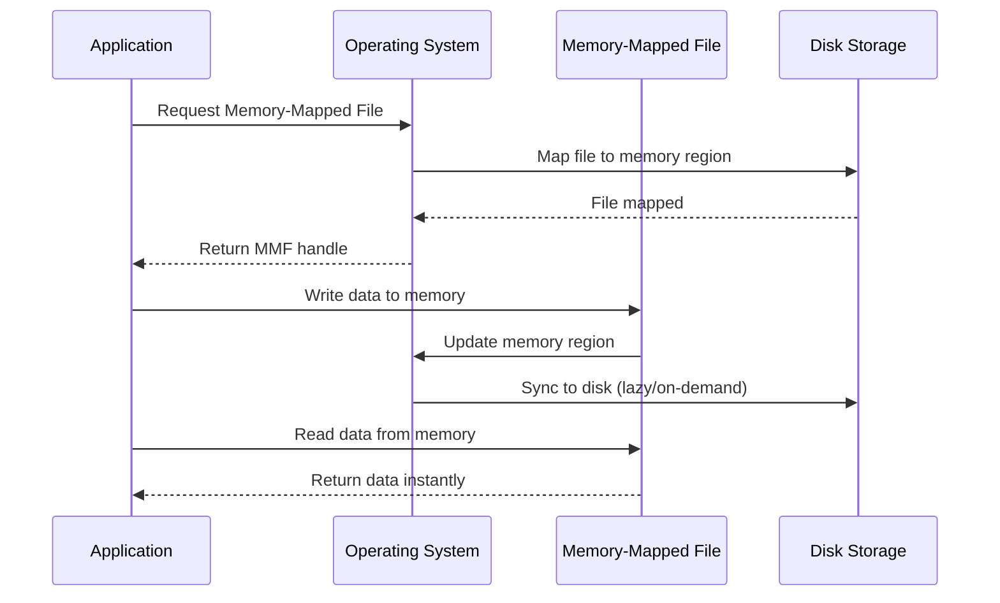
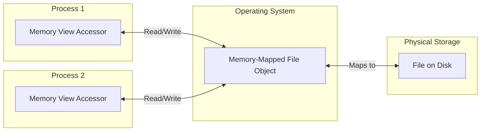
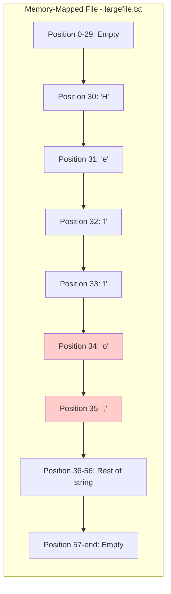

# Operating System Lab - Week 6
## Process Management and Memory-Mapped Files in C#

---

## Table of Contents
1. [Memory-Mapped Files](#memory-mapped-files)
2. [Code Examples](#code-examples)

---

## Memory-Mapped Files

### What are Memory-Mapped Files?

Memory-mapped files create a direct mapping between a file on disk and a region in memory (RAM). This allows you to:
- Access file data as if it were regular memory
- Share data between multiple processes efficiently
- Work with large files by loading only needed portions
- Perform random access operations quickly

### How It Works



### Key Advantages

1. **Fast Access**: Direct memory access is much faster than traditional file I/O
2. **Random Access**: Jump to any position in the file instantly
3. **Inter-Process Communication**: Multiple processes can share the same memory-mapped region
4. **Efficient for Large Files**: Load only the portions you need into memory

### Memory-Mapped File Architecture



---

## Code Examples

### Example 1: Memory-Mapped File (MMF.cs)

This example demonstrates creating and using a memory-mapped file to write and read data.

```csharp
using System.IO.MemoryMappedFiles;
using System.Text;

namespace Process_MMF;

public class MMF
{
    public static void Main(string[] args)
    {
        // Define the file path and size
        string filePath = "largefile.txt";
        long fileSize = 1024 *  // = 1 KB
                        1024 *  // = 1 MB
                        100;    // = 100 MB
    
        // Create or open the memory-mapped file
        using (
            var mmf = MemoryMappedFile.CreateFromFile(
                filePath, 
                FileMode.OpenOrCreate, 
                null, 
                fileSize
            ))
        {
            // Create a memory-mapped view accessor to read and write data
            using (var accessor = mmf.CreateViewAccessor())
            {
                // Write data to the memory-mapped file
                string dataToWrite = "Hello, Memory-Mapped Files!";
                byte[] dataBytes = Encoding.UTF8.GetBytes(dataToWrite);
                
                // Write starting at byte position 30
                accessor.WriteArray(30, dataBytes, 0, dataBytes.Length);
    
                // Read 2 bytes starting at position 34
                byte[] readData = new byte[2];
                accessor.ReadArray(34, readData, 0, 2);
    
                string readDataString = Encoding.UTF8.GetString(readData);
                Console.WriteLine("Data read from memory-mapped file: " + readDataString);

                Console.ReadKey();
            }
        }
    }
}
```

#### Code Explanation

**File Size Calculation:**
```csharp
long fileSize = 1024 * 1024 * 100;  // 100 MB
```
- Creates a 100 MB file
- 1024 bytes = 1 KB
- 1024 KB = 1 MB
- 100 MB total

**Creating the Memory-Mapped File:**
```csharp
var mmf = MemoryMappedFile.CreateFromFile(filePath, FileMode.OpenOrCreate, null, fileSize)
```
- `filePath`: Name of the file to map
- `FileMode.OpenOrCreate`: Creates file if it doesn't exist, opens if it does
- `null`: Default mapping name (unnamed mapping)
- `fileSize`: Size of the memory-mapped region

**View Accessor:**
```csharp
var accessor = mmf.CreateViewAccessor()
```
- Creates an accessor to read/write to the mapped memory
- Provides random access to any byte position

**Writing Data:**
```csharp
accessor.WriteArray(30, dataBytes, 0, dataBytes.Length);
```
- Writes data starting at byte position 30 in the file
- Parameters: (position, data, offset, count)

**Reading Data:**
```csharp
accessor.ReadArray(34, readData, 0, 2);
```
- Reads 2 bytes starting at position 34
- Position 34 would read "o," from "Hello" (H=30, e=31, l=32, l=33, o=34)

#### Memory Layout Visualization



---

## Summary

This lab covered:

1. **Memory-Mapped Files**: Efficient file access and inter-process communication through memory mapping

### Key Takeaways

- Memory-mapped files provide fast, random access to large files
- Cross-platform compatibility requires OS-specific handling for process execution
- The .NET MemoryMappedFile class works seamlessly across platforms

---

## Practice Exercises

1. Modify the MMF code to write and read at different positions
2. Create two separate programs that communicate through a shared memory-mapped file
3. Implement a cross-platform process launcher that detects the OS automatically
4. Experiment with different file sizes and measure performance differences

---

## Additional Resources

- [Microsoft Docs: MemoryMappedFile Class](https://learn.microsoft.com/en-us/dotnet/api/system.io.memorymappedfiles.memorymappedfile)
- [Microsoft Docs: ProcessStartInfo Class](https://learn.microsoft.com/en-us/dotnet/api/system.diagnostics.processstartinfo)
- [.NET Cross-Platform Development](https://learn.microsoft.com/en-us/dotnet/core/introduction)
