# Operating System Lab - Week 7
## C# Threading and Concurrency

---

## Table of Contents
1. [Introduction](#introduction)
2. [Program, Process, and Thread](#program-process-and-thread)
3. [Threading Basics](#threading-basics)
4. [Synchronous vs Asynchronous Execution](#synchronous-vs-asynchronous-execution)
5. [Thread Lifecycle and Management](#thread-lifecycle-and-management)
6. [Race Conditions and Synchronization](#race-conditions-and-synchronization)
7. [Thread Pool](#thread-pool)
8. [Performance Analysis: Single vs Multi-threaded](#performance-analysis-single-vs-multi-threaded)
9. [Practical Examples](#practical-examples)

---

## Introduction

This lab explores threading concepts in C# and demonstrates how to create, manage, and synchronize threads in .NET applications. Threading enables concurrent execution of multiple operations, improving application performance and responsiveness.

**Learning Objectives:**
- Understand the difference between programs, processes, and threads
- Create and manage threads in C#
- Implement thread synchronization mechanisms
- Recognize and prevent race conditions
- Compare single-threaded and multi-threaded performance
- Utilize the ThreadPool for efficient task management

---

## Program, Process, and Thread

### Definitions

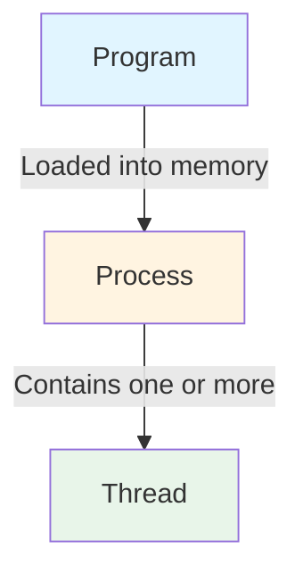

**Program**: A static set of instructions stored on disk (executable file). It contains code and data but does not execute by itself.

**Process**: An instance of a program in execution. When you run a program, the operating system creates a process that includes:
- Memory space (code, data, heap, stack)
- System resources (file handles, network connections)
- At least one thread of execution

**Thread**: The smallest unit of execution within a process. Multiple threads within the same process share:
- Memory space
- Resources
- File descriptors

Each thread has its own:
- Program counter
- Stack
- Register set

### Relationship Diagram

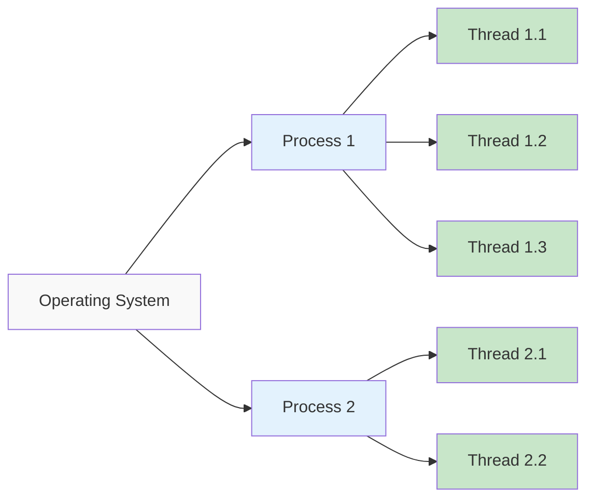

---

## Threading Basics

### Creating and Starting a Thread

The fundamental steps to work with threads in C#:

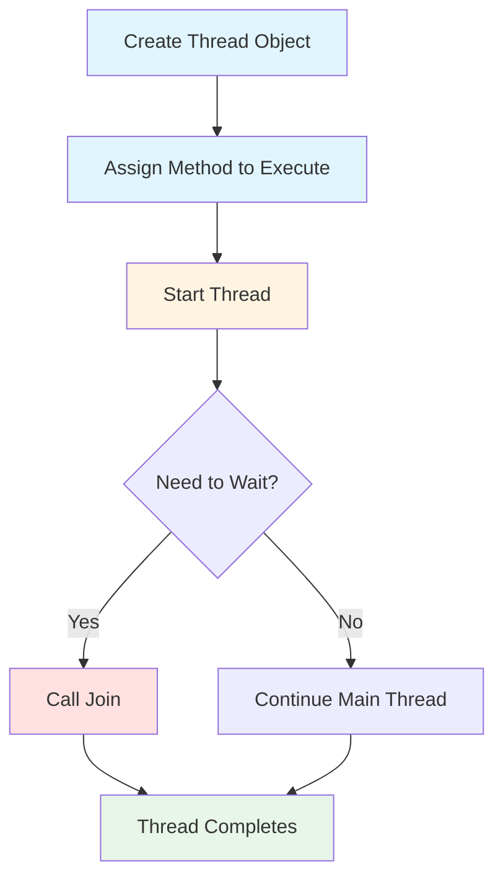

### Example 1: Basic Thread Creation

```csharp
using System;
using System.Threading;

class Program
{
    static void Main()
    {
        Console.WriteLine("Main thread started.");

        // Create a new thread, passing in the method it should execute
        Thread myThread = new Thread(PrintNumbers);

        // Start the thread
        myThread.Start();
        
        // Using Fork-Join style with threads
        // Wait for the new thread to complete
        myThread.Join();

        Console.WriteLine("Main thread completed.");
    }

    // Method to be executed in a separate thread
    static void PrintNumbers()
    {
        Console.WriteLine("Secondary thread started.");

        // Loop to print numbers from 1 to 5
        for (int i = 1; i <= 5; i++)
        {
            Console.WriteLine($"Number: {i}");
            Thread.Sleep(500); // Pause for 500ms to simulate work
        }

        Console.WriteLine("Secondary thread completed.");
    }
}
```

**Key Points:**
- `Thread` constructor takes a method delegate (`ThreadStart`)
- `Start()` begins thread execution
- `Join()` blocks the calling thread until the target thread completes (Fork-Join pattern)
- `Thread.Sleep()` pauses execution for a specified duration

**Expected Output:**
```
Main thread started.
Secondary thread started.
Number: 1
Number: 2
Number: 3
Number: 4
Number: 5
Secondary thread completed.
Main thread completed.
```

---

## Synchronous vs Asynchronous Execution

### Synchronous Execution

Operations execute sequentially, one after another. Each operation must complete before the next begins.

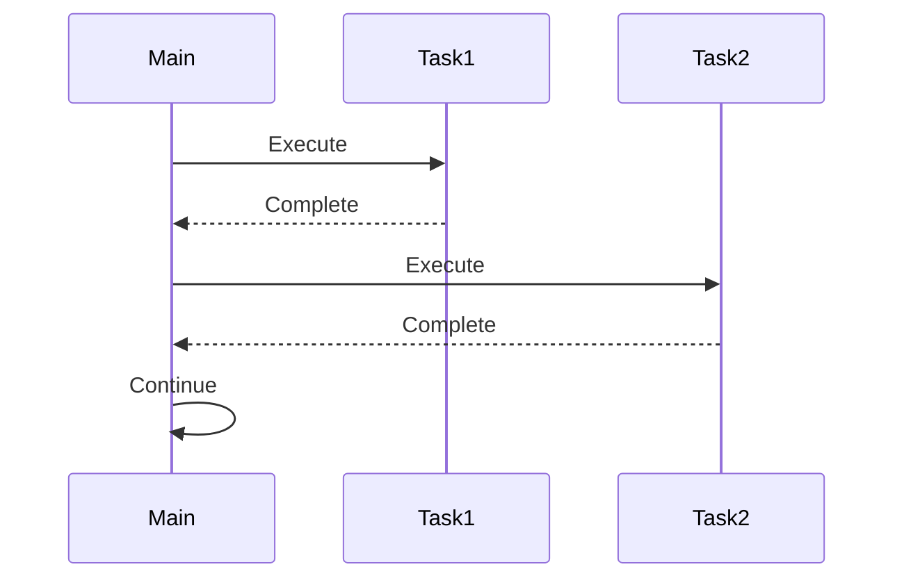

### Asynchronous Execution

Multiple operations can execute concurrently. Operations can start before previous ones complete.

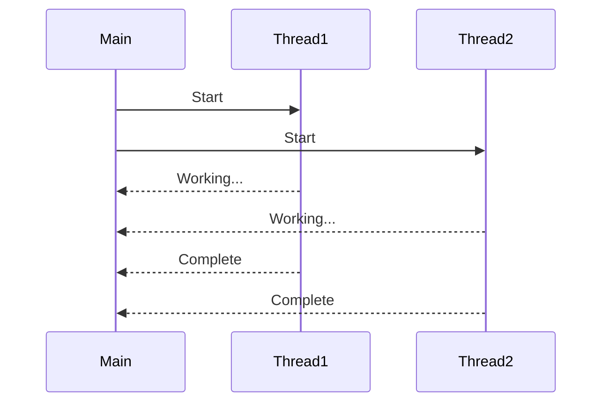

### Example: Sequential vs Parallel Execution

```csharp
using System.Diagnostics;

namespace Threading;

public class Program
{
    public static void Main()
    {
        // Measure execution time
        Stopwatch stopwatch = new Stopwatch();
        stopwatch.Start();
        
        PingPong();
        
        stopwatch.Stop();
        Console.WriteLine($"Time elapsed: {stopwatch.ElapsedMilliseconds} ms");
    }

    private static void PingPong()
    {
         // Sequential execution (Synchronous)
         // Ping();
         // Pong();
        
         Console.WriteLine("--------------------");
        
         // Parallel execution (Asynchronous)
         Thread pingThread = new Thread(Ping);
         Thread pongThread = new Thread(Pong);
        
         // Background vs Foreground threads
         pingThread.IsBackground = true;
         pongThread.IsBackground = true;
        
         // Start the threads
         pingThread.Start();
         pongThread.Start();
        
         Console.WriteLine("--------------------");
        
         // Wait for both threads to complete
         pingThread.Join();
         pongThread.Join();
        
         Console.WriteLine("Join finished");
    }
    
    // Loop to be executed by the thread
    private static void Ping()
    {
        for (int i = 0; i < 100; i++)
        {
            Console.WriteLine($"Ping: {i}");
        }
    }
    
    private static void Pong()
    {
        for (int i = 0; i < 100; i++)
        {
            Console.WriteLine($"Pong: {i}");
        }
    }
}
```

**Observations:**
- **Sequential**: Ping completes entirely before Pong starts
- **Parallel**: Ping and Pong execute simultaneously, output interleaves
- Parallel execution typically faster for I/O-bound or independent tasks

---

## Thread Lifecycle and Management

### Thread States

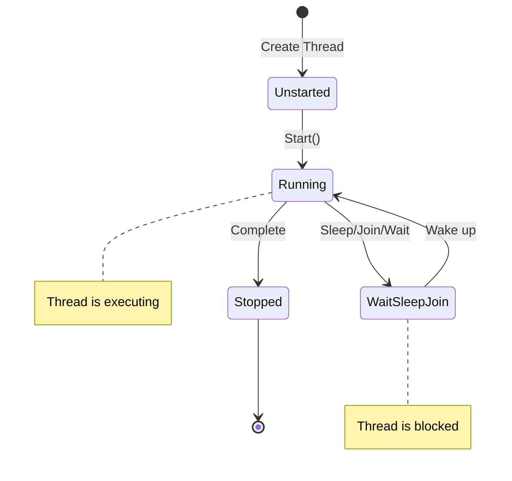

### Background vs Foreground Threads

**Foreground Threads** (Default):
- Keep the application alive
- Application doesn't exit until all foreground threads complete

**Background Threads**:
- Do not prevent application from exiting
- Terminated automatically when all foreground threads finish

```csharp
// Setting thread as background
pingThread.IsBackground = true;
pongThread.IsBackground = true;
```

### Thread Methods

**Common Methods:**

| Method | Description |
|--------|-------------|
| `Start()` | Begins thread execution |
| `Join()` | Blocks calling thread until the target thread completes |
| `Sleep(ms)` | Pauses thread for specified milliseconds |
| `Abort()` | ❌ Deprecated - Forcefully terminates thread (not recommended) |

**Important Notes:**
- `Abort()` is no longer supported in modern .NET (dangerous and unpredictable)
- Cannot call `Start()` on a thread more than once (throws exception)
- Use `Join()` to implement synchronization points

---

## Race Conditions and Synchronization

### What is a Race Condition?

A race condition occurs when multiple threads access shared data simultaneously, and the outcome depends on the unpredictable timing of thread execution.

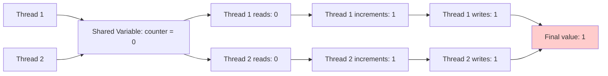

**Expected**: counter = 2  
**Actual**: counter = 1 (Race condition!)

### Example: Race Condition with ThreadPool

```csharp
using System;
using System.Threading;

class Program
{
    // Shared variable to demonstrate race condition
    static int counter = 0;
    static object lockObject = new object(); // Lock object to prevent race conditions

    static void Main()
    {
        Console.WriteLine("Starting Thread Pool Example with Increment and Decrement Tasks");

        // ThreadPool example - queue multiple tasks to increment and decrement counter
        ThreadPool.SetMaxThreads(50, 50);
        ThreadPool.QueueUserWorkItem(IncrementCounter);
        ThreadPool.QueueUserWorkItem(DecrementCounter);
        ThreadPool.QueueUserWorkItem(IncrementCounter);
        ThreadPool.QueueUserWorkItem(DecrementCounter);

        // Wait for a moment to see race condition effect
        Thread.Sleep(500); // Note: this is for demo purposes, not ideal in real applications

        Console.WriteLine($"Final counter value after Thread Pool (may vary due to race condition): {counter}");
    }

    // Method to increment the counter in ThreadPool
    static void IncrementCounter(object state)
    {
        // WITHOUT LOCK (Race condition can occur)
        for (int i = 0; i < 100; i++)
        {
            counter++;
        }
        Thread.Sleep(1); // Small delay to increase race condition chance
    }

    // Method to decrement the counter in ThreadPool
    static void DecrementCounter(object state)
    {
        // WITHOUT LOCK (Race condition can occur)
        for (int i = 0; i < 100; i++)
        {
            counter--;
        }
        Thread.Sleep(1); // Small delay to increase race condition chance
    }
}
```

**Expected Output**: 0 (200 increments - 200 decrements)  
**Actual Output**: Varies (e.g., -23, 15, 42) due to race conditions

### Preventing Race Conditions with Locks

```csharp
static void IncrementCounter(object state)
{
    // WITH LOCK (No race condition)
    lock (lockObject)
    {
        for (int i = 0; i < 100; i++)
        {
            counter++;
        }
        Thread.Sleep(1);
    }
}

static void DecrementCounter(object state)
{
    // WITH LOCK (No race condition)
    lock (lockObject)
    {
        for (int i = 0; i < 100; i++)
        {
            counter--;
        }
        Thread.Sleep(1);
    }
}
```

### How Locks Work

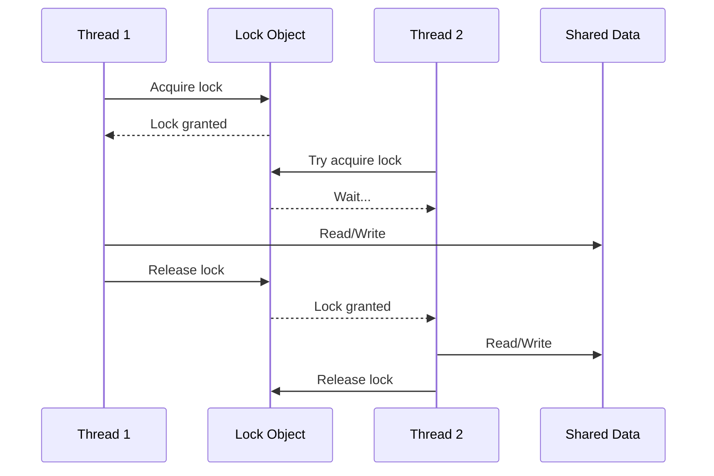

**Key Concepts:**
- `lock` statement ensures only one thread executes the critical section at a time
- Other threads wait until the lock is released
- Always lock on a dedicated object (`private static object lockObject`)
- Never lock on `this`, types, or strings

---

## Thread Pool

### What is ThreadPool?

ThreadPool is a collection of pre-created threads managed by the .NET runtime. Instead of creating new threads for each task, you can queue work items to the ThreadPool.

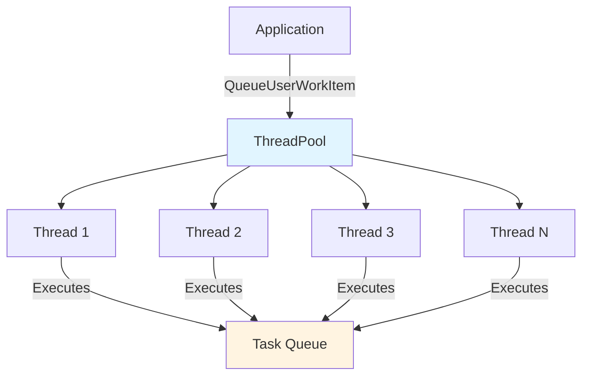

### Advantages of ThreadPool

1. **Efficiency**: Reuses existing threads instead of creating new ones
2. **Resource Management**: Limits maximum number of concurrent threads
3. **Performance**: Reduces overhead of thread creation and destruction
4. **Automatic Management**: .NET runtime handles thread lifecycle

### ThreadPool vs Manual Threads

| Feature | ThreadPool | Manual Threads |
|---------|-----------|----------------|
| Creation overhead | Low (reuses threads) | High (creates new) |
| Control | Limited | Full control |
| Best for | Short tasks | Long-running operations |
| Cleanup | Automatic | Manual |

### Using ThreadPool

```csharp
// Set maximum threads (optional)
ThreadPool.SetMaxThreads(50, 50);

// Queue work items
ThreadPool.QueueUserWorkItem(IncrementCounter);
ThreadPool.QueueUserWorkItem(DecrementCounter);
```

---

## Performance Analysis: Single vs Multi-threaded

### Comparison Example

This example compares single-threaded and multi-threaded execution for summing one billion numbers.

```csharp
using System;
using System.Diagnostics;
using System.Threading;

class Program
{
    static long totalSum = 0; // Shared variable to hold the total sum
    static object lockObject = new object(); // Lock object to prevent race conditions

    static void Main()
    {
        Console.WriteLine("Single-threaded process started.");

        // Start timing
        Stopwatch stopwatch = new Stopwatch();
        stopwatch.Start();

        // Perform the task: Sum one billion numbers
        CalculatePartialSum(1, 1_000_000_000);

        // Stop timing
        stopwatch.Stop();

        Console.WriteLine($"Single-threaded sum: {totalSum}");
        Console.WriteLine($"Time taken (single-threaded): {stopwatch.ElapsedMilliseconds} ms");

        // -----------------------------------------------------
        Console.WriteLine("\nMulti-threaded process started.");
        totalSum = 0;
        
        // Start timing
        stopwatch.Reset();
        stopwatch.Start();
        
        // Define ranges for each thread
        Thread thread1 = new Thread(() => CalculatePartialSum(1, 250_000_000));
        Thread thread2 = new Thread(() => CalculatePartialSum(250_000_001, 500_000_000));
        Thread thread3 = new Thread(() => CalculatePartialSum(500_000_001, 750_000_000));
        Thread thread4 = new Thread(() => CalculatePartialSum(750_000_001, 1_000_000_000));
        
        // Start all threads
        thread1.Start();
        thread2.Start();
        thread3.Start();
        thread4.Start();
        
        // Wait for all threads to complete
        thread1.Join();
        thread2.Join();
        thread3.Join();
        thread4.Join();
        
        // Stop timing
        stopwatch.Stop();
        
        Console.WriteLine($"Multi-threaded sum: {totalSum}");
        Console.WriteLine($"Time taken (multi-threaded): {stopwatch.ElapsedMilliseconds} ms");
    }

    // Method to calculate partial sum within a range
    static void CalculatePartialSum(int start, int end)
    {
        // Calculate partial sum locally (no contention)
        long partialSum = 0;
        for (int i = start; i <= end; i++)
        {
            partialSum += i;
        }
        
        // Lock only when updating shared variable
        lock (lockObject)
        {
            totalSum += partialSum;
        }
    }
}
```

### Execution Flow

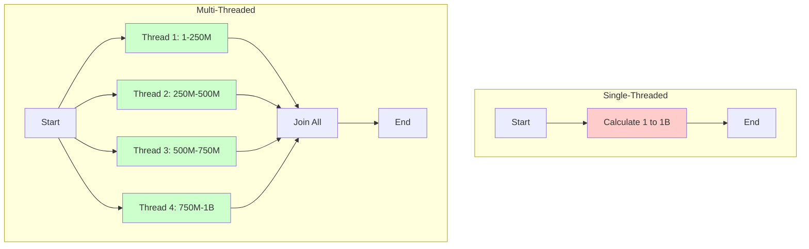

### Optimization Strategy: Partial Sum

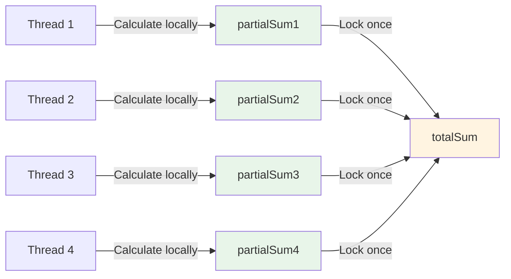

**Three Approaches:**

1. **Without Lock (Incorrect)**:
```csharp
// ❌ Race condition - incorrect result
for (int i = start; i <= end; i++)
{
    totalSum += i;
}
```

2. **With Lock on Every Iteration (Slow)**:
```csharp
// ✓ Correct but very slow - excessive locking
for (int i = start; i <= end; i++)
{
    lock (lockObject)
    {
        totalSum += i;
    }
}
```

3. **Partial Sum with Lock (Optimal)**:
```csharp
// ✓✓ Correct and fast - minimal locking
long partialSum = 0;
for (int i = start; i <= end; i++)
{
    partialSum += i;
}
lock (lockObject)
{
    totalSum += partialSum;
}
```

### Performance Results

**Typical Results on a 4-core CPU:**

| Approach | Time | Speedup |
|----------|------|---------|
| Single-threaded | 4000 ms | 1x |
| Multi-threaded (4 threads) | 1200 ms | 3.3x |

**Key Insights:**
- Multi-threading provides significant speedup for CPU-bound tasks
- Speedup is not linear due to overhead and synchronization
- Proper lock strategy is crucial for performance
- Best performance: minimize lock contention by reducing lock frequency

---

## Practical Examples

### Example 1: Thread Naming

```csharp
private static void MainThreadName()
{
    // Get the current thread
    Thread currentThread = Thread.CurrentThread;
    
    // Get the current thread's name
    string currentThreadName = currentThread.Name ?? "No name";
    Console.WriteLine($"Current thread name: {currentThreadName}");
    
    // Set the current thread's name
    currentThread.Name = "Main Thread";
    Console.WriteLine($"Current thread name: {currentThread.Name}");
}
```

### Example 2: Lambda Expressions with Threads

```csharp
// Using lambda expressions to pass parameters
Thread thread1 = new Thread(() => CalculatePartialSum(1, 250_000_000));
```

### Example 3: Thread States

```csharp
Thread myThread = new Thread(DoWork);

Console.WriteLine(myThread.ThreadState); // Unstarted
myThread.Start();
Console.WriteLine(myThread.ThreadState); // Running
myThread.Join();
Console.WriteLine(myThread.ThreadState); // Stopped
```

---

## Best Practices

### Do's ✓

1. **Use ThreadPool for short tasks**: Efficient for many small operations
2. **Minimize lock duration**: Lock only critical sections
3. **Use local variables**: Reduce shared state to minimize contention
4. **Set threads as background**: Prevent blocking application shutdown
5. **Handle exceptions**: Wrap thread code in try-catch blocks
6. **Use Join() carefully**: Avoid deadlocks with circular waits

### Don'ts ✗

1. **Don't use Abort()**: Deprecated and dangerous
2. **Don't lock on public objects**: Use private lock objects
3. **Don't lock on types or strings**: Can cause deadlocks
4. **Don't create too many threads**: Causes overhead and resource exhaustion
5. **Don't ignore race conditions**: Always protect shared data
6. **Don't forget to dispose**: Clean up resources properly

---

## Summary

### Key Concepts Covered

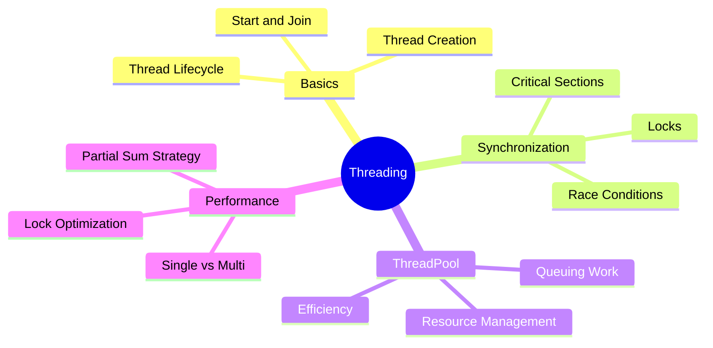

### Threading Decision Flow

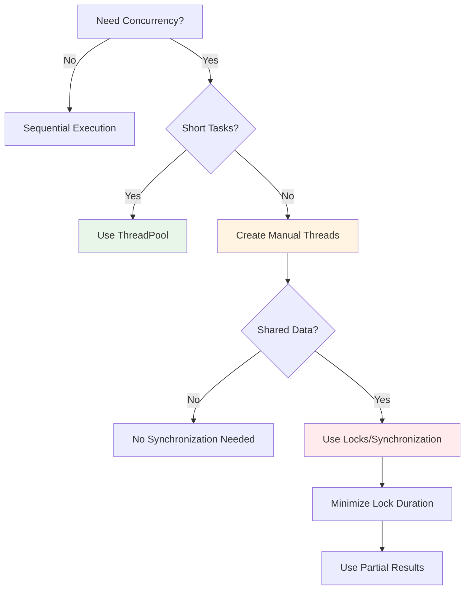

---

## Lab Exercises

### Exercise 1: Basic Threading
Create a program with two threads that print even and odd numbers simultaneously from 1 to 100.

### Exercise 2: Race Condition
Modify the ThreadPool example to:
1. First run without locks and observe incorrect results
2. Add locks and verify correct results
3. Compare execution times

### Exercise 3: Performance Analysis
Create a program that:
1. Multiplies two large matrices (1000x1000)
2. Implements both single-threaded and multi-threaded versions
3. Compares execution times
4. Analyzes speedup vs number of threads (1, 2, 4, 8)

### Exercise 4: Producer-Consumer
Implement a simple producer-consumer pattern using threads and locks.

---

## References and Further Reading

- Microsoft .NET Threading Documentation
- "C# Threading Handbook" - Best practices for concurrent programming
- Operating System Concepts (Silberschatz) - Chapter on Threads
- Understanding thread synchronization primitives
- Performance optimization in multi-threaded applications

---

## Questions to Consider

1. When should you use multi-threading vs single-threading?
2. What are the trade-offs between ThreadPool and manual thread creation?
3. How do race conditions occur and how can they be prevented?
4. Why is the partial sum approach faster than locking on every iteration?
5. What happens if you forget to call Join() on a foreground thread?
6. How does the number of CPU cores affect multi-threaded performance?

---

**End of Lab Document**
